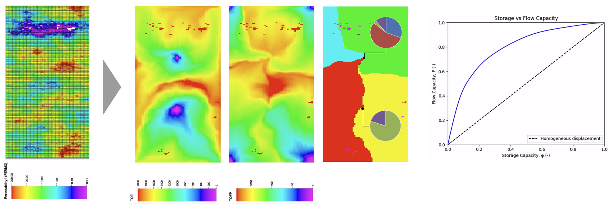

# Flow Diagnostics Toolkit

This repository provides a Python-based tool for flow diagnostics in reservoir simulation. To our knowledge, it is the first open-source, lightweight Python-based flow diagnostics tool coupled with commercial reservoir simulators.

## Features
- Read reservoir simulator outputs (fluxes, pore volume, cell connections, well info, etc.)
  - SLB reservoir simulators: we developed `ecl_reader.py` that reads ECLIPSE/IX style binary simulation outputs. This script alone may be useful for other applications that require parsing and processing ECLIPSE style binary output files.
  - CMG reservoir simulators: we utilize [sr3_reader](https://github.com/nikolai-andrianov/sr3_reader/blob/main/README.md) (slightly modified to support LGR).
- Solves the time-of-flight (TOF) and tracer concentrations equations (finite volume).
- Compute other diagnostics, if applicable:
  - Allocation factors
  - Lorentz curves and sweep efficiencies

## Installation

Ensure you have [Anaconda](https://www.anaconda.com/products/distribution) installed, then create a conda environment using the provided `environment.yml` file:

```
conda env create -f environment.yml
conda activate pyfd
```

## Usage

**Prerequisites**

Before running pyFD, ensure that you have completed a reservoir simulation and that the output includes all necessary data for flow diagnostics. This should include pore volume, fluxes, cell connections, and well information, stored in the binary output files.

* For SLB simulators (or OPM): ensure that you generate `.INIT` and `.EGRID` files. Additionally, specify `FLORES` under `RPTPST` keyword to output fluxes in reservoir conditions. Alternatively, the tool also works if both fluxes in surface conditions and formation volume factors are available.
* For CMG simulators: Use `FLUXCON` along with `OUTSRF` keyword to output fluxes in reservoir condition.

**Running the tool**

Via the command line:

```
python pyfd_cli.py -f <PATH_TO_DATA/AFI_FILE> -t <LIST_OF_TSTEPS_OF_INTEREST>
```

Arguments:
- `-f <PATH_TO_SIMULATOR_PRIMARY_INPUT_FILE>`: Path to the reservoir simulation primary input file (.DATA, .AFI, or .DAT).
- `-t <LIST_OF_TSTEPS_OF_INTEREST>`: List of reservoir simulation output (grid dynamic simulation results) time step indices to run the diagnostics on.
- `-d`: An optional argument to enable debug mode.

### Example:

Using command line interface (CLI):
```
python pyfd_cli.py -f /path/to/simulation.DATA -t 1 5 10
```

Or, in your Python script:

```python
from flow_diagnostics import FlowDiagnostics

tsteps = [1,5,10]
fd = FlowDiagnostics("/path/to/simulation.DATA")
for tstep in tsteps:
    fd.execute(tstep)
```

The code will identify the simulator type based on the file path (extension) and then use appropriate binary reader. 

## Output

The script generates a folder named `CASENAME.fdout` in the same directory as the provided `DATA/AFI/DAT` file. This folder contains:
- Grid flow diagnostics results (time-of-flight, flow partitioning, well pair IDs) in Petrel readable (`.GRDECL`) format.
- If applicable:
  - Allocation factors.
  - Lorentz curve data.
  - Sweep efficiencies.

Sample results:
<p align="center"> 
<br/><em>SPE10 top layer: TOF, flow partition, Lorentz curve</em> </p> 

<p align="center"> 
<br/><em>SAIGUP: permeability and TOF</em> </p> 

## Project Status
This project is actively maintained and under development. 
- ✅ Core functionality implemented for SLB reservoir simulators.
- ✅ Prototype support for CMG reservoir simulators.
- ✅ Tested with various types of grid systems using benchmark cases:
  - Single-porosity
  - Dual-porosity dual/single-permeability
  - Faulted reservoirs (NNCs)
  - Embedded discrete fracture model (EDFM)
  - Combinations of the above
- 🛠️ Planned improvements:
  - More testing with IX, OPM, and CMG (not yet fully tested)
  - Multidimensional upstream (MDU) weighting - currently uses single-point upstream (SPU) weighting.
  
- 🚀 Looking for contributors! Feel free to open an issue or submit a PR.

## Dependencies

Required core dependencies are installed via `environment.yml`.
Additionally, we utilize [sr3_reader](https://github.com/nikolai-andrianov/sr3_reader/blob/main/README.md) (slightly modified to support LGR) for processing CMG binary outputs.

## References

- Datta-Gupta, A., & King, M. J. (2007). Streamline simulation: theory and practice (Vol. 11). Society of Petroleum Engineers.
- Møyner, O., Krogstad, S., & Lie, K. A. (2015). The application of flow diagnostics for reservoir management. SPE Journal, 20(02), 306-323.
- [MRST Flow Diagnostics module by SINTEF](https://www.sintef.no/projectweb/mrst/modules/diagnostics/).
- Shahvali, M., Mallison, B., Wei, K., & Gross, H. (2012). An alternative to streamlines for flow diagnostics on structured and unstructured grids. SPE Journal, 17(03), 768-778.
- Shook, G. M., & Mitchell, K. M. (2009, October). A robust measure of heterogeneity for ranking earth models: The F-Phi curve and dynamic Lorenz coefficient. In SPE Annual Technical Conference and Exhibition (pp. SPE-124625). SPE.

## License

See the [LICENSE](LICENSE) file for details.

## Disclaimer

Some functionalities related to CMG simulators are not yet fully validated, as complete documentation of simulator-specific keywords is not available in their manuals.
Additionally, [sr3_reader](https://github.com/nikolai-andrianov/sr3_reader/blob/main/README.md) is not officially supported by CMG.
