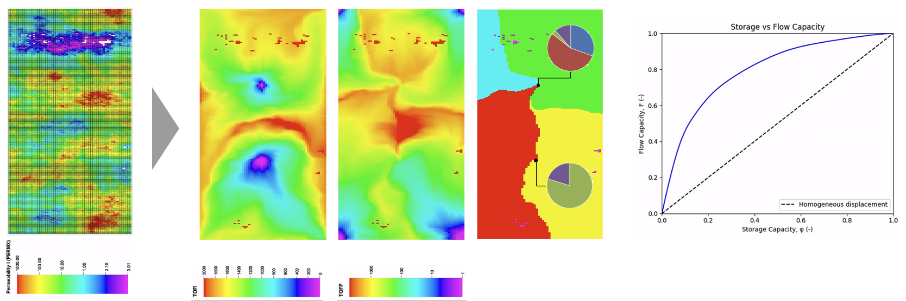
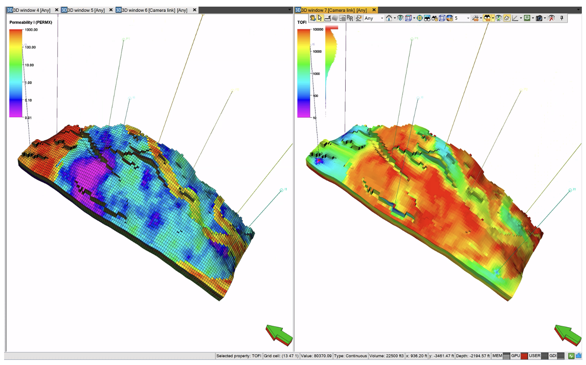

Usage
=====

Prerequisites
-------------

Before running, ensure that you have completed a reservoir simulation and that
the output includes all necessary data for flow diagnostics. This should
include pore volume, fluxes, cell connections, and well information, stored in
the binary output files.

- For SLB simulators (or OPM): ensure that you generate ``.INIT`` and
  ``.EGRID`` files. Additionally, specify ``FLORES`` under ``RPTPST`` keyword
  to output fluxes in reservoir conditions. Alternatively, the tool also works
  if both fluxes in surface conditions and formation volume factors are
  available.
- For CMG simulators: Use ``FLUXCON`` along with ``OUTSRF`` keyword to output
  fluxes in reservoir condition.

Running the tool
----------------

Via the command line:

.. code-block:: console

   pyflowdiagnostics -f <PATH_TO_DATA/AFI_FILE> -t <LIST_OF_TSTEPS_OF_INTEREST>

Arguments:

- ``-f <PATH_TO_SIMULATOR_PRIMARY_INPUT_FILE>``: Path to the reservoir
  simulation primary input file (.DATA, .AFI, or .DAT).
- ``-t <LIST_OF_TSTEPS_OF_INTEREST>``: List of reservoir simulation output
  (grid dynamic simulation results) time step indices to run the diagnostics
  on.
- ``-d``: An optional argument to enable debug mode.

Example
-------

Using command line interface (CLI):

.. code-block:: console

   pyflowdiagnostics -f /path/to/simulation.DATA -t 1 5 10

Or, in your Python script:

.. code-block:: python

   import pyflowdiagnostics.flow_diagnostics as pfd

   tsteps = [1, 5, 10]

   fd = pfd.FlowDiagnostics("/path/to/simulation.DATA")
   for tstep in tsteps:
       fd.execute(tstep)

The code will identify the simulator type based on the file path (extension) and then use appropriate binary reader. 

Output
------

The script generates a folder named ``CASENAME.fdout`` in the same directory as
the provided ``DATA/AFI/DAT`` file. This folder contains:

- Grid flow diagnostics results (time-of-flight, flow partitioning, well pair
  IDs) in Petrel readable (``.GRDECL``) format.
- If applicable:

  - Allocation factors.
  - Lorentz curve data.
  - Sweep efficiencies.

Sample results:

   SPE10 top layer: TOF, flow partition, allocation factors, Lorentz curve.

   SAIGUP: permeability and TOF.
